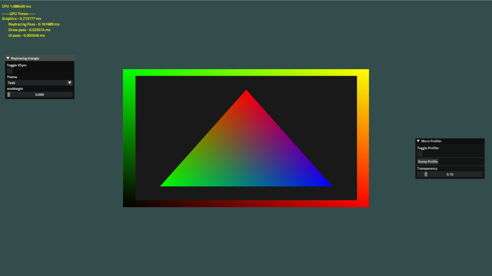

# Learning-The-Forge

## 1.triangle

## 2. Texture

## 3. Compute Shader

## 4. Raytracing Triangle

[D3D12RaytracingHelloWorld](https://github.com/microsoft/DirectX-Graphics-Samples/tree/master/Samples/Desktop/D3D12Raytracing/src/D3D12RaytracingHelloWorld)